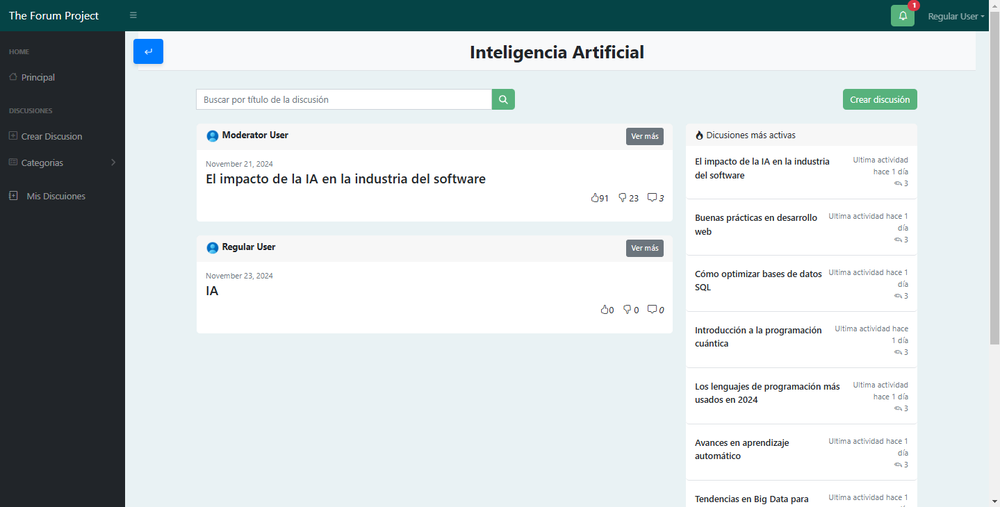
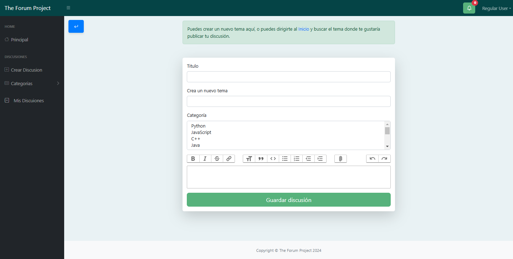
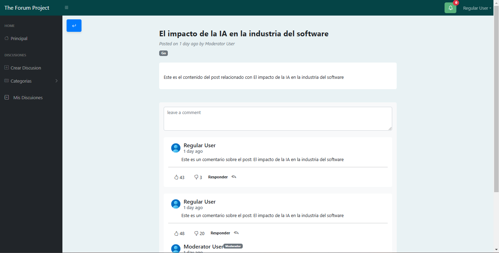

<p align="center"><a href="https://laravel.com" target="_blank"></a></p>


## About The Forum Project

## Proyecto de Laravel con Blade, Breeze y MySQL

## Descripción
Este proyecto es una aplicación desarrollada en Laravel que utiliza Blade como motor de plantillas, Breeze para la autenticación y gestión básica de usuarios, y MySQL como base de datos.

Incluye migraciones, seeders y usuarios precargados para un inicio rápido.

## Requisitos previos
Asegúrate de tener las siguientes herramientas instaladas en tu sistema:
- **PHP** >= 8.1  
- **Composer**  
- **MySQL**  
- **Node.js** y **npm**

## Instalación

Sigue los pasos a continuación para configurar y ejecutar el proyecto:

### 1. Clonar el repositorio
```bash
git clone <URL-del-repositorio>
cd <nombre-del-proyecto>
```
### 2. Instalar dependencias
Ejecuta los siguientes comandos para instalar las dependencias de PHP y JavaScript:
```bash
composer install
npm install
npm run dev
```
### 3. Configurar el archivo .env
Copia el archivo .env.example y renómbralo como .env:
```bash
cp .env.example .env
```
Edita el archivo .env para configurar los detalles de tu base de datos:
```bash
DB_CONNECTION=mysql
DB_HOST=127.0.0.1
DB_PORT=3306
DB_DATABASE=<nombre_de_tu_base_de_datos>
DB_USERNAME=<usuario_de_tu_base_de_datos>
DB_PASSWORD=<contraseña_de_tu_base_de_datos>

```
### 4. Ejecutar las migraciones y seeders
Este paso creará las tablas en la base de datos y precargará datos iniciales:
```bash
php artisan migrate --seed
```
### 6. Servir la aplicación
Ejecuta el servidor de desarrollo:
```bash
php artisan serve
```
## Datos de acceso predefinidos
Se ha creado un usuario administrador precargado con las siguientes credenciales:

#### Rol: Superadmin
Email: admin@example.com  
Contraseña: password
#### Rol: Admin
Email: moderator@example.com  
Contraseña: password
#### Rol: Usuario
Email: user@example.com   
Contraseña: password 


## Vistas Principales

#### home.blade.php


#### topihome.blade.php


#### post/create.blade.php


#### post/show.blade.php


